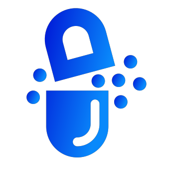

# TeleMed

TeleMed is a powerful and comprehensive Flutter application that aims to revolutionize the medical field by providing essential features such as medical imaging, symptom checking, and seamless communication with top doctors. We have integrated advanced machine learning models through a Flask backend server to ensure accurate predictions and enhanced user experience. TeleMed is especially beneficial for people living in remote areas, offering fast and convenient access to healthcare services. With the future aspects of Electronic Medical Records (EMR) using Google Cloud for Healthcare and more, TeleMed will be a game-changer in the healthcare industry.

## Features

1. **Medical Imaging**: The app scans MRI and CT scans and identifies brain tumors, skin cancer, and lung cancer using machine learning models.
2. **Symptom Checker**: Users can input their symptoms, and our ML model will predict the potential causes.
3. **Contact Top Doctors**: Users can communicate with top doctors via in-app chat, call, and video call.
4. **Appointment Booking**: Easily book appointments by selecting a date and time slot.
5. **Prescribed Medicines Shopping**: Purchase medicines prescribed by doctors through the app.
6. **User Authentication**: Secure user authentication with Firebase.
7. **Payment Integration**: Razorpay gateway for smooth and secure payments.

## Future Aspects
- **Integration of Electronic Medical Records (EMR)** using **Google Cloud for Healthcare**.
- Expansion of **medical imaging capabilities** to include more types of scans and conditions.
- Integration of **wearable health devices** for real-time monitoring of vital signs.
- Addition of **health and fitness tracking features** to promote proactive healthcare.
- Incorporation of **AI-assisted personalized health recommendations** based on user data.

## Getting Started

These instructions will help you get a copy of the project up and running on your local machine for development and testing purposes.

### Prerequisites

- Flutter
- Android Studio or Visual Studio Code
- Firebase Account
- Razorpay Account
- Flask installed
- TFlite setup

### Installation

1. *Clone the repository*
   https://github.com/FoxxPratikSau/TeleMed.git

2. *Change directory*
   `cd TeleMed`

3. *Install dependencies*
   `flutter pub get`

4. *Setup Firebase*

- Create a new Firebase project and download the `google-services.json` file.
- Place the file in the `android/app` directory.
- Follow the instructions for setting up Firebase Authentication.

5. *Setup Razorpay*

- Create a new Razorpay account and follow the instructions to get API keys.
- Update the API keys in the `lib/screens/cart_page.dart` file.

6. *Setup TFLite*

- run the batch file `install.bat` at the root directory to get the relevant structure needed to run tflite models on Android Devices

7. *Start the Flask server*
- go to the `Symptom Model` and start the Flask server.
- Write `python app.py` on the terminal.
- Change the address in the Symptom checker page inside `lib`.

8. *Run the app*
   `flutter run`
## ScreenShots

## Running the TeleMed app on an emulator or physical device
1. Open the project in Android Studio or Visual Studio Code.
2. Make sure the device or emulator is connected and detected.
3. Run the following command in the terminal to start the app: `flutter pub get` and `flutter run`

## Contributing

If you want to contribute to this project, you can follow these steps:

1. Fork this repository.
2. Create a new branch with a descriptive name.
3. Make changes and commit them.
4. Push the changes to your forked repository.
5. Create a pull request.

## Authors

- [Nitin Chandra Sahu](https://github.com/sahunitin023)
- [Pratik Ranjan Sau](https://github.com/FoxxPratikSau)
- Ravi Kumar
- [Dibya Ranjan Sahu](https://github.com/dibyacoder)
